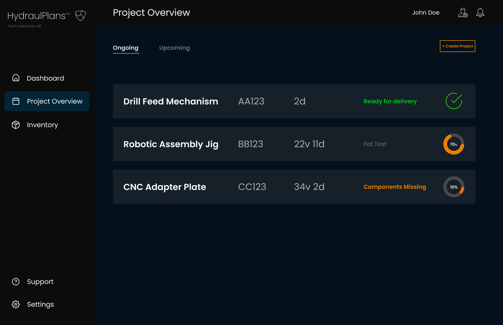
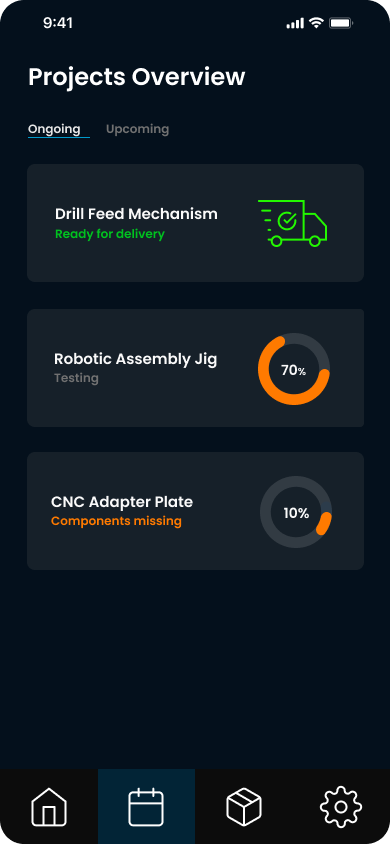

# Old documentation

This folder holds a snapshot of an earlier direction. In 2023 the UI and UX idea for what became this project was explored under the HydraulPlans / hydraulics planning angle. The screens below are from that period: a desktop-style layout and a mobile layout. They are not the current Nordshark ERP client, but they show where the visual and interaction thinking started.

Figma (2023 exploration): [HydraulPlans on Figma](https://www.figma.com/design/4LVfdKQvzyed601gVSRQXw/HydraulPlans?node-id=196-168&t=y0ldLvPGrNhh8VMl-0)

Desktop:

Mobile:

